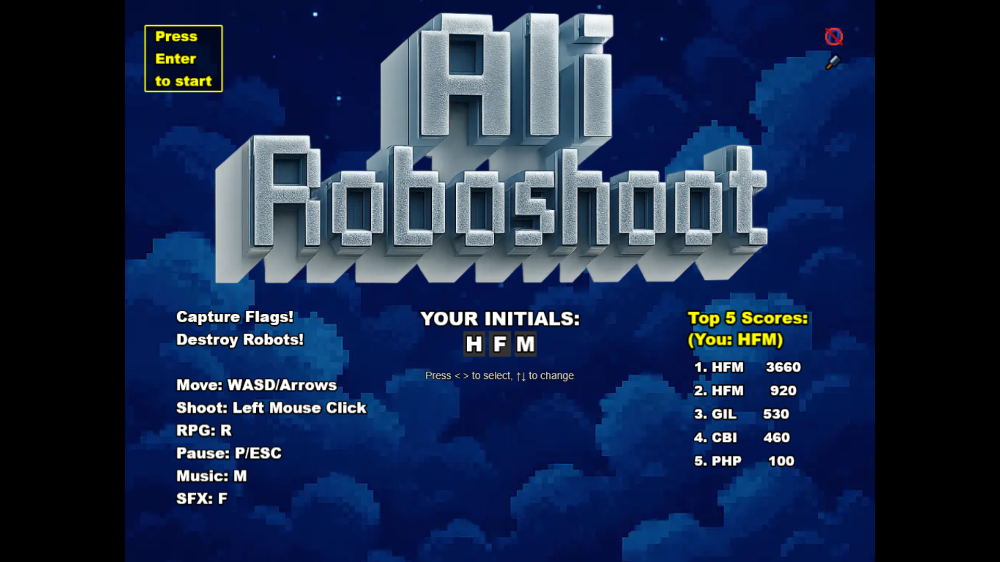

# Alibaba Robot Shooter Game

A web-based robot shooter game built with Phaser 3. Play as a combat red car and defend against waves of enemy robots!



A fast-paced, top-down arcade shooter built with Phaser 3 and Vite. Take command of an advanced combat vehicle and battle waves of robotic enemies in a futuristic sci-fi world!

---

## Game Overview

**Ali Roboshoot** is a browser-based action game where you control a heavily armed combat vehicle fighting against relentless robot adversaries (Scarabs, Hornets, Spiders, & Orange Samurai Robot). Use quick reflexes, tactical movement, powerful weapons (including RPGs), and strategic objective captures to survive and achieve a high score!

## Features

- Fast-paced, top-down arcade shooting action
- Control an advanced combat vehicle with 8-directional movement
- Multiple enemy types with unique attack patterns (melee, ranged, strafing)
- Objective Capture mechanic: Capture flags for bonus points
- Pickup system: Collect health, ammo, RPG ammo, and temporary fire rate boosts
- RPG secondary weapon with area-of-effect damage
- Time-based difficulty scaling: Enemies become more numerous and spawn faster over time
- Dynamic explosions and visual effects (enemy hit flash, screen shake)
- Enemy health bar indicators
- Engaging retro pixel art style
- Online leaderboard via API (Top 5 scores displayed)
- Simple, responsive controls (Keyboard + Mouse Aim)
- Background Music and Sound Effects with mute toggles
- Pause functionality
- Built for instant play in any modern web browser

## How to Play

- **Move:** Arrow keys or WASD
- **Shoot (Primary):** Left Mouse Button (aims towards cursor)
- **Shoot (RPG):** R Key (aims towards cursor)
- **Pause:** P Key
- **Return to Main Menu (from Pause):** Q Key
- **Restart Game (from Game Over):** R Key
- **Return to Main Menu (from Game Over):** M Key
- **Toggle Music (in Main Menu):** M Key
- **Toggle SFX (in Main Menu):** F Key

Survive as long as possible, capture flags, destroy robots, collect pickups, and climb the leaderboard!

---

## Getting Started

### Requirements

- [Node.js](https://nodejs.org) is required to install dependencies and run scripts via `npm`.

### Setup & Development

1. **Install dependencies:**
    ```bash
    npm install
    ```
2. **Start the dev server:**
    ```bash
    npm run dev
    ```
    The game will be available at [http://localhost:5173](http://localhost:5173)
3. **Build for production:**
    ```bash
    npm run build
    ```
    The optimized output will be in the `dist` folder.

---

## Project Structure

- `index.html` – Main HTML entry point
- `src/` – Game source code (scenes, logic, assets)
- `public/assets/` – Game art, sprites, and effects
- `public/style.css` – Basic page styling

---

## Credits

Game developed by bO-05 inspired by [Alibaba Cloud Web Game Challenge](https://dev.to/challenges/alibaba).

Built with [Phaser 3](https://phaser.io/) and [Vite](https://vitejs.dev/)

Art and assets © respective creators or generated for this project.

---

## Acknowledgements

We gratefully acknowledge the following contributors/ platforms/ frameworks for their assets and inspiration:

- **Frameworks:**
  - Vite
  - Phaser 3
- **Graphic Assets:**
  - Matt Walkden
  - Edu Silv Art
  - OpenAI Sora
- **Sound Effects and Music - All from Pixabay:**
  - freesound_community 
  - Driken Stan 
  - DjLofi 

Their creative work made this project possible. Thank you!